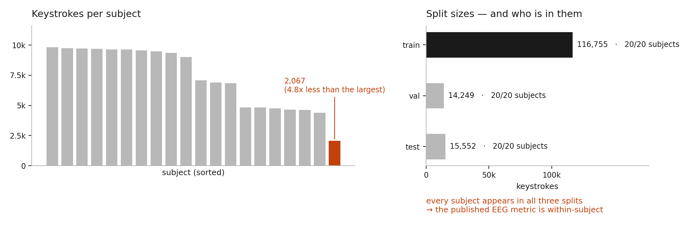

# The EEG half of Brain2Qwerty v1

Meta's [Brain2Qwerty](https://github.com/facebookresearch/brain2qwerty) is the
result everyone points at for non-invasive brain-to-text. It's also where the
"MEG works, EEG doesn't" story comes from, which matters a lot if you care
about EEG, since EEG is the only one of the two you can put on someone's head
and send them home.

So I went looking at how the EEG side of that comparison is actually set up,
using the public [SpanishBCBL](https://huggingface.co/datasets/bcbl190626/SpanishBCBL)
recordings. Three things, roughly in order of how much they bothered me.



## 1. The EEG benchmark never holds out a subject

`Brain2QwertyV1Splitter` buckets sentences by TF-IDF similarity and fills
train/val/test until the keystroke ratios come out right. Subject isn't part of
that decision at all. Which means:

| split | keystrokes | subjects |
|-------|-----------:|---------:|
| train | 116,755    | 20       |
| val   | 14,249     | 20       |
| test  | 15,552     | 20       |

All 20 subjects are in all three splits. 20 in both train and test, 0 in test
but not train. So the EEG number everyone cites is within-subject — the model
already saw that person's brain while training. There's no held-out-subject
result anywhere in the release, and you can't get one by configuring the
splitter, you'd have to replace it.

What makes this more than bookkeeping is `merger_config.per_subject = True`.
The spatial merger learns per-subject weights. A subject the model has never
seen doesn't have degraded weights, it has none. Nobody has published what that
costs, and it's the number you'd want if your plan is to record a lot of
different people rather than a lot of hours from a few.

## 2. The code doesn't run on the EEG study it registers

`studies/spanishbcbl.py` registers `Pinet2024Eeg` — 62 timelines, 20 subjects,
61 channels at 1000 Hz — and the EEG recordings ship in the same dataset repo.
But `main.py:71` does this:

```python
subject_id = ns.extractors.LabelEncoder(event_types="Meg", event_field="subject")
```

On EEG the events are type `Eeg`, so that matches nothing and `Data.build()`
raises before training starts:

```
File ".../main.py", line 72, in build
    subject_id.prepare(events)
File ".../neuralset/extractors/base.py", line 667, in _get_field_values
    raise ValueError(f"No events found for {self.name}")
ValueError: No events found for LabelEncoder
```

To be fair about scope: run the repo the way it's documented and everything
works, because the shipped config points at MEG. This only bites if you aim it
at the EEG study sitting in the same codebase. Inferring the modality from the
extractor is enough — [`patches/eeg_path.patch`](patches/eeg_path.patch). After
that the 537M-param model builds and starts training on EEG.

Two more MEG-only bits survive the patch but just quietly do nothing:
`transforms.py:40` drops a sentence by a `Pinet2024Meg`-prefixed UID, and
`utils.py:170-181` holds MEG-only subject exclusions and duplicate merges.
Neither crashes. They're also not doing their job on EEG.

## 3. The merger is sized for a MEG array

`model_config.py` sets `n_virtual_channels = 270`. That's the MEG sensor count.
EEG here has 61 electrodes.

The merger projects real sensors onto virtual ones through Fourier position
embeddings, so on EEG the default asks for a 4.4x expansion of a signal that
volume conduction has already smeared. Maybe that's fine and the extra capacity
just goes unused. Maybe it isn't. The release doesn't say, so
[`eeg_config.py`](eeg_config.py) makes it a parameter you can sweep.

## Data

146,556 keystrokes, 46,241 words, 3,963 sentences, 62 recordings, 20 subjects
after preprocessing. Per-subject keystrokes run 2,067 to 9,833, median 8,043 —
a 4.8x spread, which again matters when there are per-subject layers. A handful
of recordings get dropped by the loader for missing `.mat` logs.

## Running it

Python 3.12+, about 15GB of disk, no GPU needed.

```bash
git clone https://github.com/facebookresearch/brain2qwerty.git && cd brain2qwerty
pip install -r requirements.lock && pip install -e . --no-deps

hf download bcbl190626/SpanishBCBL --repo-type dataset \
    --local-dir ./SpanishBCBL --include "EEG/*"
pip install huggingface_hub==0.33.0   # the CLI pulls 2.x and transformers rejects it

cp ../b2q-eeg-audit/eeg_config.py brain2qwerty_v1/config/
cp ../b2q-eeg-audit/eeg_benchmark_audit.py .
git apply ../b2q-eeg-audit/patches/eeg_path.patch

export BRAIN2QWERTY_STUDIES=$PWD/SpanishBCBL
export BRAIN2QWERTY_CACHE=$PWD/cache
python eeg_benchmark_audit.py
```

Output goes to [`results/eeg_audit_results.json`](results/eeg_audit_results.json),
and `make_figure.py` rebuilds the figure from it.

That `huggingface_hub` line cost me an hour, so it's in here for the next person.

## Next

The obvious experiment is leave-one-subject-out: train on 19, test on the 20th,
watch what the per-subject merger does with nothing to fall back on. Swapping
the splitter is easy. The interesting question is the shape of the drop-off, and
whether sharing merger weights across subjects buys any of it back. Waiting on a
free GPU for that one.

---

The findings and code here are mine. The upstream release is Meta's, CC BY-NC
4.0 — I haven't vendored any of their code, just a patch against it.

Sabina Guliyeva · Vanderbilt
